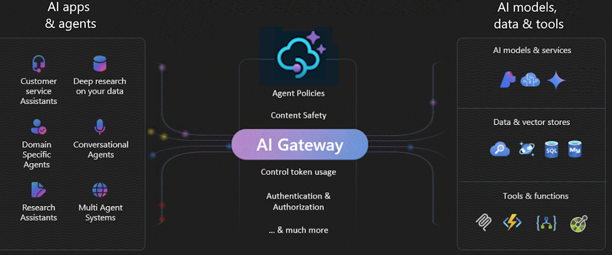
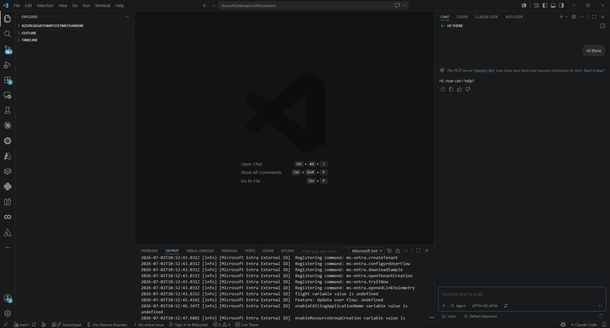
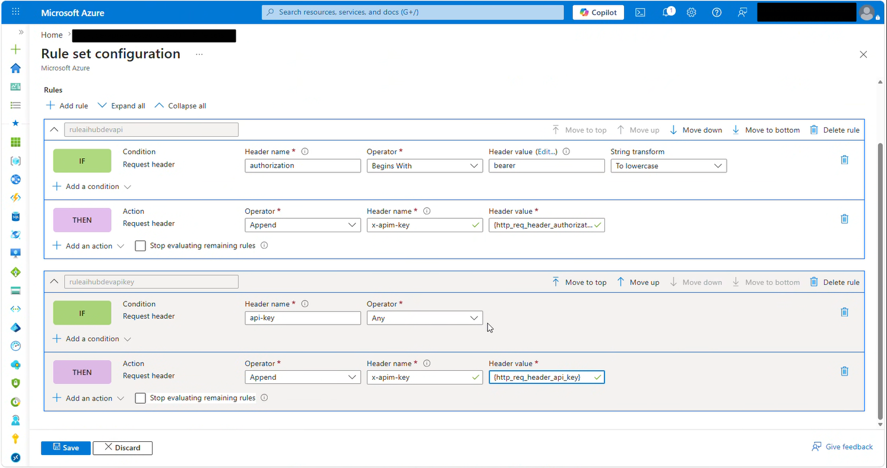
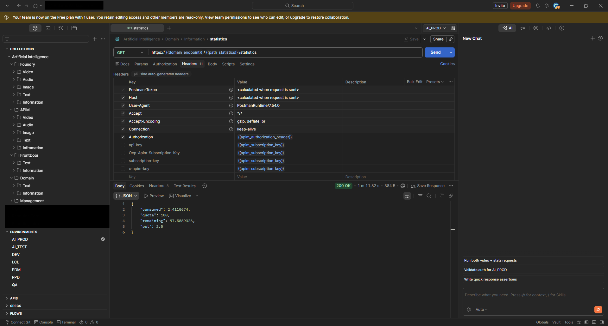
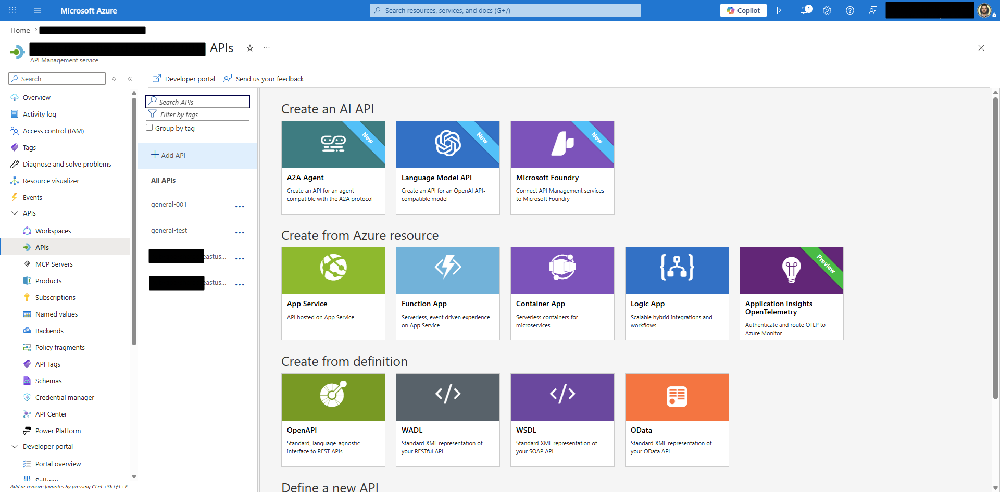
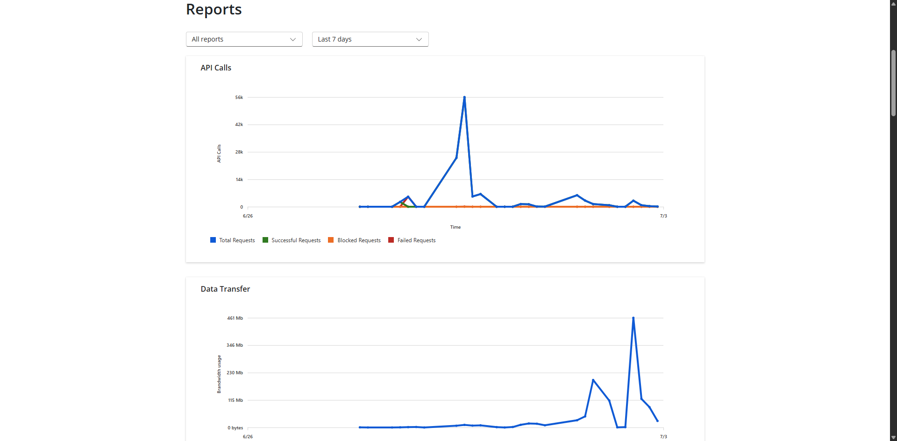
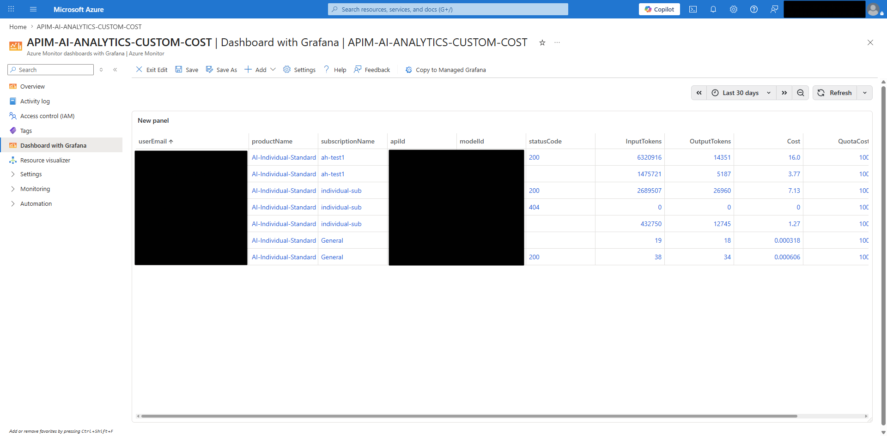
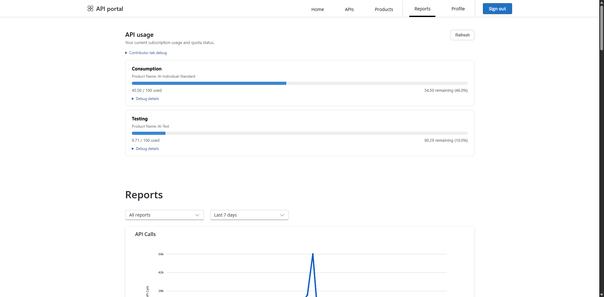
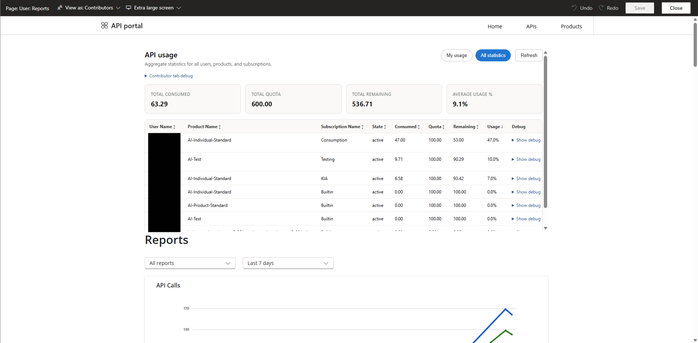

# 💸 Azure AI Gateway Cost Mechanism

  - Cost control and reporting objects for **Azure AI Gateway** across **Azure Foundry** and **Azure API Management (APIM)**.

## 🧠 Description

This repository contains reusable objects and configuration assets for implementing a **cost mechanism** on top of **Azure AI Gateway**, combining **Azure Foundry** and **APIM** capabilities.

## 💖 Sponsor

This project is freely available to everyone, but your support as a sponsor can make a real difference. By sponsoring, you help us unlock the resources needed to explore new experimental directions—ranging from advanced cost control and monitoring for extended provider and api list.

[🏷️ Sponshor this Project through GitHub](https://github.com/sponsors/koureasstavros) --and let your support shine through GitHub.

[🏷️ Sponshor this Project through PayPal](https://www.paypal.com/donate/?hosted_button_id=E6E5D545H683E) --If you're looking for a donation platform other than GitHub.

## ✨ Capabilities

The repository includes assets to configure operations and reporting for Azure AI Gateway cost tracking.

It is designed to help AI administrators:

- set cost per subscription though **cost budgets**
- calculate and track **usage-based cost signals**
- provision consolidated cost though **cost report**
- provision individual user cost view though **cost widget**
- support multiple **AI model modalities** and **providers**

The mechanism supports workloads across:

- **Text**
- **Image**
- **Audio**
- **Video**
- **Embeddings**

It also supports multiple providers, including:

- **OpenAI**
- **Anthropic**

### 🧰 AI tools connectivity

This setup can also be used behind AI developer tools such as:

- **VS Code GitHub Copilot**
- **VS Code OpenAI Codex**
- **VS Code Anthropic Claude Code**
- **GitHub Copilot desktop**
- **OpenAI Codex desktop**
- **Anthropic Claude Code desktop**
- **AI Libraries**

`AIGatewayAITool`: Example AI Tool request flow and API testing through the gateway.

To support these clients, a **Front Door** layer is required in the middle.

The Front Door is used to:

- handle the **authentication header** flow
- when header is `Authorization` trim the `Bearer ` schema/prefix from the authorization value and override the header name to x-apim-key (to support clients which sent Authorization: Bearer)
- when header is `api-key` override the header name to x-apim-key (to support clients which sent api-key)

`AIGatewayFrontDoor`: Example Front Door rule into ruleset for the gateway.

### 📊 What it measures

The mechanism can count and report:

- **Text**
- - Input tokens
- - Output tokens
- **Image**
- - Objects
- **Audio**
- - Seconds
- **Video**
- - Seconds

Current limitations:

- The mechanism currently **does not count cached tokens**.
- The mechanism currently **does not count other variations like image or video analysis**.
- You have to manually map your deployment names with cost rations

`AIGatewayPostman`: Example client request flow and API testing through the gateway.

## 🎯 Use cases

This repository is useful when you want to:

- enforce **AI consumption budgets**
- monitor **token and time-based usage**
- produce **cost and utilization reports**
- standardize **provider-specific cost handling**
- support **multi-model** and **multi-provider** AI gateways
- connect AI coding tools through a gateway path backed by **Front Door** and **APIM**

`AIGatewayPortal`: Azure portal view for gateway-related configuration and management.

## 📈 Reporting focus

The repository supports reporting scenarios for:

- personal / consolidated usage
- subscriptions / budget visibility
- operation-level statistics

`AIGatewayReportDeveloper`: Example developer report for output for personal tracked usage and cost analysis.

`AIGatewayReportContributor`: Example contibutor report for consolidated output for tracked usage and cost analysis.
 

## 📈 Widget focus

The repository supports widget scenarios for:

- personal / consolidated usage
- subscriptions / budget visibility
- operation-level statistics

`AIGatewayWidgetDeveloper`: Example developer widget for personal tracked usage and cost analysis.

`AIGatewayWidgetContributor`: Example contributor widget for consolidated tracked usage and cost analysis.

## 🧩 Supported modalities

The included assets cover common AI request types such as:

- **Text generation**
- **Image generation and edit**
- **Audio transcription and tanslation**
- **Video generation, remix and downlaod**
- **Embeddings**

## 🔌 Supported providers

Provider coverage currently includes:

- **OpenAI** operations
- **Anthropic** operations

## ⚖️ Notes

- Built for **Azure AI Gateway** scenarios using **Azure Foundry** and **APIM**
- Focused on **cost budgeting** and **cost reporting**
- Supports **input tokens**, **output tokens**, and **seconds**
- **Cached tokens are not included** in the current counting logic
- AI tool connectivity requires **Front Door** in front of **APIM** for authorization-header handling
- Front Door must remove the `Bearer ` schema/prefix before forwarding authorization data to **APIM**

## ⚙️ Further thoughts

It would be more efficient if each call included built-in cost information. Alternatively, if exposing that through the APIs is not appropriate, it could be stored as internal AI Gateway metadata in a separate table.